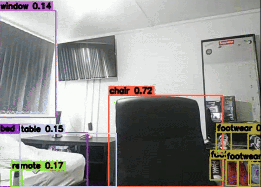

# Multi Model Real Time Object Detection AI Camera by Filip Ilovsky

This project is an advanced AI camera system that integrates two YOLOv8 models trained on COCO (80 classes) and OpenImages V7 (600+ classes) to achieve broad spectrum object recognition. Predictions are combined using Weighted Box Fusion (WBF) to intelligently merge overlapping detections, resulting in duplicate free, higher confidence results beyond the capability of a single model. The pipeline is optimized with OpenCV for real time processing of both webcam feeds and video files, enabling accurate detection across more than 600 object categories.

This project demonstrates expertise in artificial intelligence, machine learning, deep learning model integration, ensemble methods, and real time computer vision systems.

## ✨ Features
- Combines COCO + OpenImages V7 models for broad object coverage  
- Uses Weighted Box Fusion (WBF) for duplicate free, high confidence detections  
- Supports both **real-time webcam feeds** and **video file input/output**  
- Ability to save processed videos with detections into `videos/outputs/`  
- Configurable model sizes (`s/m/l`) and image resolutions to balance speed vs accuracy   

## 🎥 Demo

Real time webcam detection:



Real time mp4 detection:


## 🚀 Setup

If you have any problems scroll down to `⚠️ Notes`

1. Clone the repository:
   ```bash
   git clone https://github.com/Filip-2002/AI-live-camera.git
   cd AI-live-camera


2. Create and activate a virtual environment:

   Windows

   ```bash
   python -m venv .venv
   .\.venv\Scripts\activate
   ```

   MacOS/Linux

   ```bash
   python3 -m venv .venv
   source .venv/bin/activate
   ```


3. Install dependencies:
   ```bash
   pip install -r requirements.txt


4. Download YOLOv8 pretrained weights and place them in the project folder:

   Default (what this project uses):  
   - [YOLOv8l COCO weights (yolov8l.pt)](https://github.com/ultralytics/assets/releases/download/v0.0.0/yolov8l.pt) (Large)
   - [YOLOv8l OpenImages V7 weights (yolov8l-oiv7.pt)](https://github.com/ultralytics/assets/releases/download/v0.0.0/yolov8l-oiv7.pt) (Large)

   Optional (other sizes available for different speed/accuracy trade-offs):  
   - [YOLOv8m COCO weights](https://github.com/ultralytics/assets/releases/download/v0.0.0/yolov8m.pt) (Medium)
   - [YOLOv8m OpenImages V7 weights](https://github.com/ultralytics/assets/releases/download/v0.0.0/yolov8m-oiv7.pt) (Medium)
   - [YOLOv8s COCO weights](https://github.com/ultralytics/assets/releases/download/v0.0.0/yolov8s.pt) (Small)
   - [YOLOv8s OpenImages V7 weights](https://github.com/ultralytics/assets/releases/download/v0.0.0/yolov8s-oiv7.pt) (Small)   

   **Performance vs Accuracy:**  
   - **`s` (small models):** Fastest, runs well on lower end machines, but less accurate.  
   - **`m` (medium models):** Good balance between speed and accuracy.  
   - **`l` (large models):** Most accurate, but slower, best on more powerful hardware. 
   - More information about how to change models in `⚠️ Notes`

   More model sizes can be found on the [Ultralytics YOLOv8 releases page](https://github.com/ultralytics/assets/releases).

   


5. Run:

   Webcam

   Default (CPU, works on all machines):

   ```bash
   python run_webcam_wbf.py
   ```

   Use GPU for faster performance (requires an NVIDIA GPU with CUDA):
  
   ```bash
   python run_webcam_wbf.py --device cuda
   ```

   Force CPU explicitly (useful if CUDA is installed but you prefer CPU):

   ```bash
   python run_webcam_wbf.py --device cpu
   ```

   Save your webcam output by adding ` --save` before running, for example:

   ```bash
   python run_webcam_wbf.py --device cpu --save
   ```


   Video Files
   
   Run a video from `/videos` folder:

   ```bash
   python run_webcam_wbf.py --source example.mp4
   ```

   Run and save the output video (saved to `videos/outputs/`): 

   ```bash
   python run_webcam_wbf.py --source example.mp4 --save
   ```


## ⚠️ Notes

- macOS users: Allow your Terminal app access to the Camera in System Settings → Privacy & Security → Camera.

- If you see ModuleNotFoundError (e.g., cv2), make sure your virtual environment is activated (look for (.venv) in your terminal prompt).

- Windows users: If `python` doesn’t work, try using `python3` instead.  

- If you get `pip` version errors, upgrade pip inside the virtual environment:  

  Windows

  ```bash
  python -m pip install --upgrade pip
  ```

  MacOS/Linux  

  ```bash
  python3 -m pip install --upgrade pip
  ```

- When switching between projects, deactivate your virtual environment with:

  ```bash
  deactivate

- If you see OpenCV camera errors on macOS, make sure no other application (e.g. Zoom, Teams, or browser) is already using the webcam.

- You can adjust the input image size in `run_webcam_wbf.py` on line 55 (`"--imgsz"`) depending on your machine’s performance:  
  - If your machine is struggling, set the default to **320**.  
  - If your machine is powerful, set the default to **1280**.  
  - The default value (**640**) is a balanced option. 

- You can change the model size in `run_webcam_wbf.py` on lines 52 (`"--coco"`) and 53 (`"--oiv7"`) depending on your machine’s performance:  
  - If your machine is struggling, use `"yolov8s.pt"` and `"yolov8s-oiv7.pt"`, or `"yolov8m.pt"` and `"yolov8m-oiv7.pt"`.  
  - Make sure to download the corresponding model weights in **Step 4**. 

- By default, the script automatically selects GPU if available, otherwise falls back to CPU. You can force this behavior with ` --device cuda` (GPU) or ` --device cpu`.

- Use the ` --save` flag to save processed output (works for both webcam and video files). Saved videos go into `videos/outputs/`.
